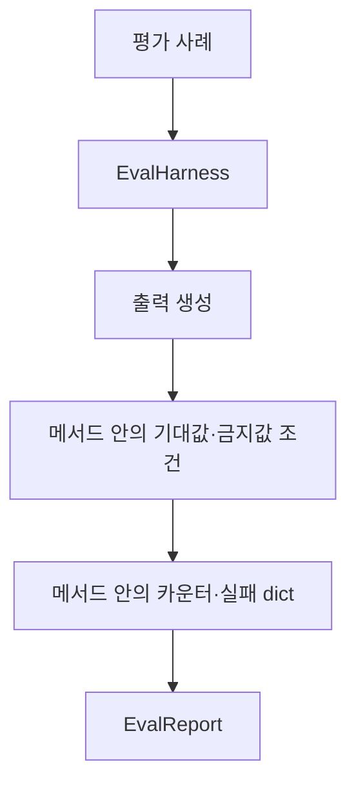
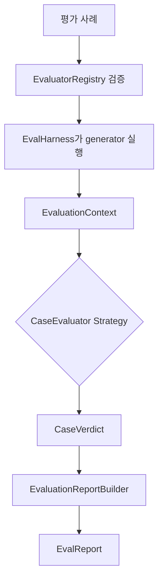

# feat: preserve locality with evaluation strategies

> Synthetic GitHub artifact: true  
> 최초 PR 시점의 설명입니다. 이후 리뷰 대화와 결과는 포함하지 않습니다.

## 요약

locality를 target text 검사 대신 **baseline 출력 보존 여부**로 평가하도록 바꿨습니다.
사례별 평가 규칙, evaluator registry, 결과 집계를 분리해 `EvalHarness`가 실행 순서만
담당하게 했습니다.

## 주요 변경사항

- `CaseEvaluator` Strategy와 `EvaluationContext`를 추가했습니다.
  - `ExpectedAnswerEvaluator`: reliability/generalization/behavior 규칙을 담당합니다.
  - `LocalityPreservationEvaluator`: baseline 보존 규칙을 담당합니다.
- `EvaluatorRegistry`가 기본 evaluator 선택과 case-kind coverage 검증을 맡습니다.
  알 수 없는 kind나 불완전한 사용자 지정 registry는 generator 호출 전에 실패합니다.
- `EvaluationReportBuilder`가 kind별 점수, 실패 근거, `unscored_cases`를 만듭니다.
- baseline generator가 없는 locality는 `unscored`가 됩니다.
- 직접 `behavior` 요청은 `behavior` kind로 생성됩니다.

## 설계 — Strategy 패턴과 Registry/Builder 경계

`CaseEvaluator`는 `EvaluationContext` 하나를 받고 결과만 반환합니다. 새 입력이
필요해져도 evaluator method의 매개변수가 계속 늘어나지 않습니다.

`EvaluatorRegistry`는 평가 규칙의 설정이 실행 반복문에 섞이지 않게 하고,
`EvaluationReportBuilder`는 보고 형식과 점수 계산이 `EvalHarness`로 되돌아오지
않게 합니다. Harness는 검증 → generator 실행 → evaluator 선택 순서만 유지합니다.

### 변경 전



### 변경 후



## Review Points

1. **locality 점수의 의미** — `LocalityPreservationEvaluator`는 baseline 출력과의
   차이만 회귀로 처리하고, baseline이 없으면 실패 대신 `unscored`/`None`을 반환합니다.
   공백·대소문자만 정규화하는 범위와 “회귀”·“평가 불가”의 구분이 적절한지 봐 주세요.

2. **평가 실행의 안전한 확장 경계** — 사용자 지정 evaluator mapping은 전체 교체이며,
   coverage 오류는 generator 호출 전에 발생합니다. `EvaluationContext`와
   `EvaluationReportBuilder`로 실행·판정·결과 조립을 나눈 경계가 부분 실행을 막고
   새 evaluator 추가에도 충분한지 확인 부탁드립니다.

## PR Type

- [x] ✨ Feature
- [ ] 🐛 Bugfix
- [ ] ♻️ Refactoring (no functional changes, no api changes)
- [ ] 🎨 Code style update
- [ ] 📚 Docs
- [ ] 🔧 Other

## 테스트

```bash
python3 -m unittest tests.test_pipeline_eval_harness -q
python3 -m unittest tests.test_pipeline -q
python3 -m unittest discover -s tests -q
```

새 계약 테스트 6건, 기존 pipeline 테스트 5건, 전체 테스트 74건이 통과했습니다.

## Formatting

각 코드 커밋 직전에 Black 26.5.1을 적용했습니다. 변경된 Python 파일의 comment token과 module/class/function docstring은 제거했으며, SQL·script template·test fixture 같은 실행용 multiline string 값은 보존했습니다. 최초 PR snapshot을 포함한 최종 변경 파일은 `black --check`를 통과했고, 원본과 재작성본의 실행 AST도 동일합니다.

## Todos

- [ ] 리뷰 의견 반영
