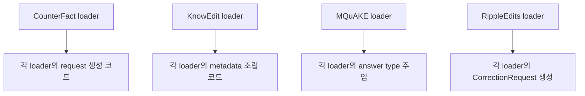
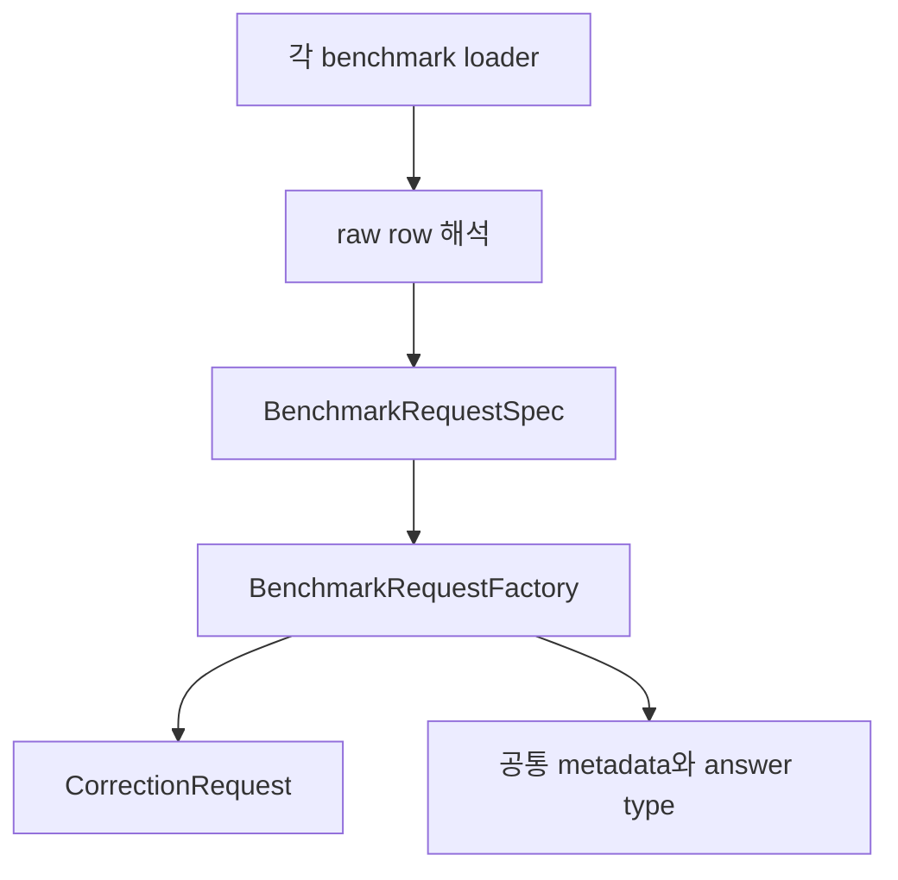

# refactor: centralize benchmark request construction

> Synthetic GitHub artifact: true  
> 최초 PR 시점의 설명입니다. 이후 리뷰 대화와 결과는 포함하지 않습니다.

## 요약

네 benchmark adapter가 반복하던 `CorrectionRequest` 생성과 공통 metadata 조립을
`BenchmarkRequestFactory`로 분리했습니다. CounterFact, KnowEdit, MQuAKE,
RippleEdits의 입력 해석과 결과 형식은 유지합니다.

## 주요 변경사항

- `BenchmarkRequestSpec`이 loader가 해석한 공통 request 값을 표현합니다.
- `BenchmarkRequestFactory`가 `CorrectionRequest` 생성, `subject`/`relation`
  metadata, answer type 주입을 한 곳에서 처리합니다.
- Factory는 caller의 `extra_metadata`를 복사해 사용하므로 입력 mapping을 수정하지
  않습니다.
- 각 loader는 자신의 benchmark schema를 해석한 뒤 spec만 만들어 Factory에 전달합니다.
- Factory 단위 테스트와 기존 benchmark adapter 테스트로 metadata 및 prompt 보존을
  검증했습니다.

## 설계 — Factory 패턴과 입력 해석 경계

`BenchmarkRequestFactory`는 공통 생성 규칙의 단일 출처입니다. 반면 각 loader는
자신의 raw row에서 subject, relation, prompt, target을 해석하는 역할만 유지합니다.
이 경계 덕분에 adapter마다 metadata 규칙이 조금씩 달라지는 문제를 막을 수 있습니다.

### 변경 전



### 변경 후



## Review Points

1. **공통 metadata 계약** — Factory가 `subject`·`relation`의 최종값을 소유하고 caller
   metadata는 수정하지 않습니다. answer type을 알 수 없을 때 key를 생략하는 정책까지
   포함해, retrieval·report가 기대하는 metadata 의미와 맞는지 확인 부탁드립니다.

2. **Factory의 책임 범위와 변환 보존** — raw schema·`limit`·benchmark별 부가 결과는
   loader에 남기고, Factory는 정규화된 factual request만 생성합니다. 네 adapter의
   JSON 동등성 비교가 prompt·locality를 포함한 기존 변환을 충분히 보존하는지 봐 주세요.

## PR Type

- [ ] ✨ Feature
- [ ] 🐛 Bugfix
- [x] ♻️ Refactoring (no functional changes, no api changes)
- [ ] 🎨 Code style update
- [ ] 📚 Docs
- [ ] 🔧 Other

## 테스트

```bash
python3 -m unittest tests.test_benchmark_adapters_factory -q
python3 -m unittest tests.test_benchmark_adapters -q
python3 -m unittest discover -s tests -q
```

새 Factory 테스트 3건, 기존 benchmark adapter 테스트 6건, 전체 테스트 77건이
통과했습니다. 네 benchmark adapter의 동일 입력 JSON은 변경 전과 `diff` 차이가
없었습니다.

## Todos

- [ ] 리뷰 의견 반영
