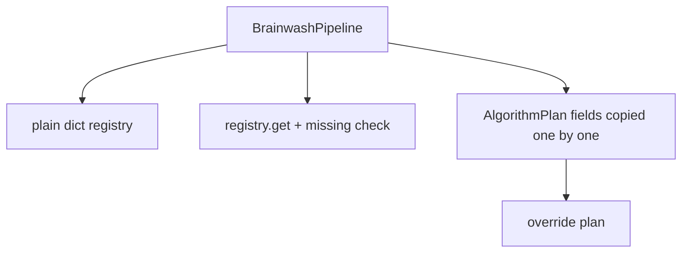
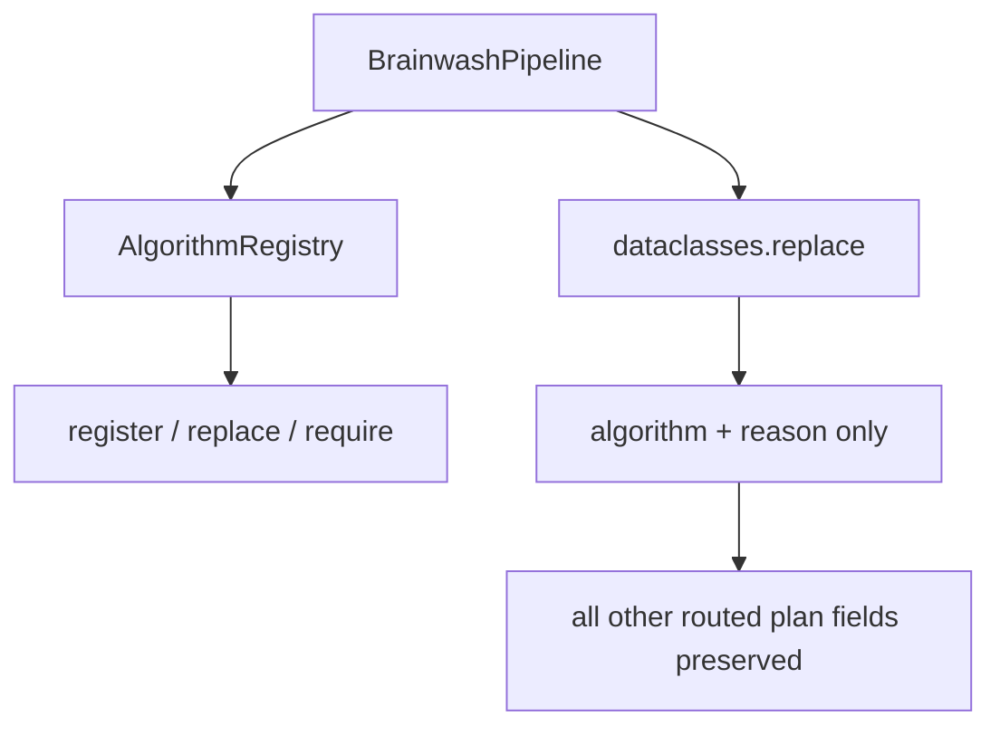

# refactor: encapsulate algorithm registry

> Synthetic GitHub artifact: true  
> 최초 PR 시점의 설명입니다. 이후 리뷰 대화와 결과는 포함하지 않습니다.

## 요약

algorithm adapter의 등록·교체·누락 처리를 `AlgorithmRegistry`로 분리하고,
`BrainwashPipeline`의 algorithm override를 `dataclasses.replace()`로 정리했습니다.
기본 routing 정책과 artifact schema는 유지합니다. 또한 RAG adapter의 등록 이름을
`RAG_CONTEXT_PATCH`로 명시해 registry key와 실행 결과의 이름이 어긋나지 않게 합니다.

## 주요 변경사항

- `AlgorithmRegistry`가 adapter 등록, 명시적 교체, mapping 호환 변환, 필수 조회를
  한 곳에서 처리합니다.
- registry는 `Mapping`과 호환되므로 기존의 `get()`·반복 조회 방식을 유지합니다.
- 빈 registry 주입은 기본 registry로 대체되지 않고, 누락 adapter 오류로 이어집니다.
- `BrainwashPipeline.plan()`은 override 시 algorithm과 reason만 바꾸며 나머지
  `AlgorithmPlan` 값은 `replace()`로 보존합니다.
- `prepare()`는 adapter 존재를 확인한 뒤 output directory를 생성하므로 잘못된 설정이
  파일 시스템에 흔적을 남기지 않습니다.
- 기본 registry는 RAG adapter를 route key와 같은 이름으로 등록합니다.
- 중복 등록·명시 교체·override 보존·빈 registry 실패 순서를 테스트로 고정했습니다.

## 설계 — Registry 패턴과 불변 plan 갱신

`AlgorithmRegistry`는 이름으로 adapter를 찾는 책임을 pipeline에서 분리한 Registry
패턴의 적용입니다. pipeline은 route 결정과 실행 순서만 담당하고, 등록 정책을 직접
알 필요가 없습니다. `AlgorithmPlan`은 frozen dataclass이므로 override는 수동 복사
대신 `replace()`를 사용해 변경 대상 두 필드만 명시합니다.

### 변경 전



### 변경 후



## Review Points

1. **registry 설정의 안전성** — 빈 registry는 기본값으로 덮지 않고, 중복 교체는
   `replace=True`로만 허용합니다. 누락 adapter는 directory 생성 전에 실패하며, RAG의
   route key·adapter 이름·결과 이름도 일치합니다. 이 설정 오류 방지 경계가 충분한지
   확인 부탁드립니다.

2. **사용자 override의 보존 범위** — `replace()`는 `algorithm`과 `reason`만 바꾸고
   confidence, fallback, candidates, stats 등 router 판단을 유지합니다. 이후
   `AlgorithmPlan` 필드가 추가되어도 이 계약이 안전한지 봐 주세요.

## PR Type

- [ ] ✨ Feature
- [x] 🐛 Bugfix
- [x] ♻️ Refactoring
- [ ] 🎨 Code style update
- [ ] 📚 Docs
- [ ] 🔧 Other

## 테스트

```bash
python3 -m unittest tests.test_pipeline_registry -q
python3 -m unittest tests.test_pipeline -q
python3 -m unittest discover -s tests -q
```

새 registry/pipeline 테스트 5건, 기존 pipeline 테스트 5건, 전체 테스트 82건이
통과했습니다. 기본 계획과 DPO override 계획의 JSON은 변경 전과 `diff` 차이가 없습니다.

## Formatting

각 코드 커밋 직전에 Black 26.5.1을 적용했습니다. 변경된 Python 파일의 comment token과 module/class/function docstring은 제거했으며, SQL·script template·test fixture 같은 실행용 multiline string 값은 보존했습니다. 최초 PR snapshot을 포함한 최종 변경 파일은 `black --check`를 통과했고, 원본과 재작성본의 실행 AST도 동일합니다.

## Todos

- [ ] 리뷰 의견 반영
