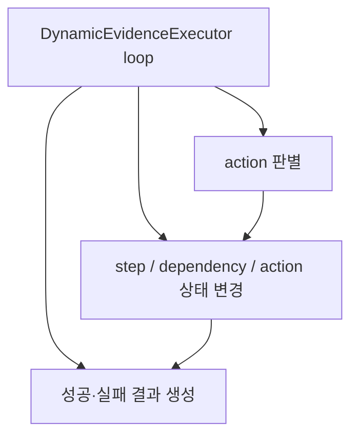
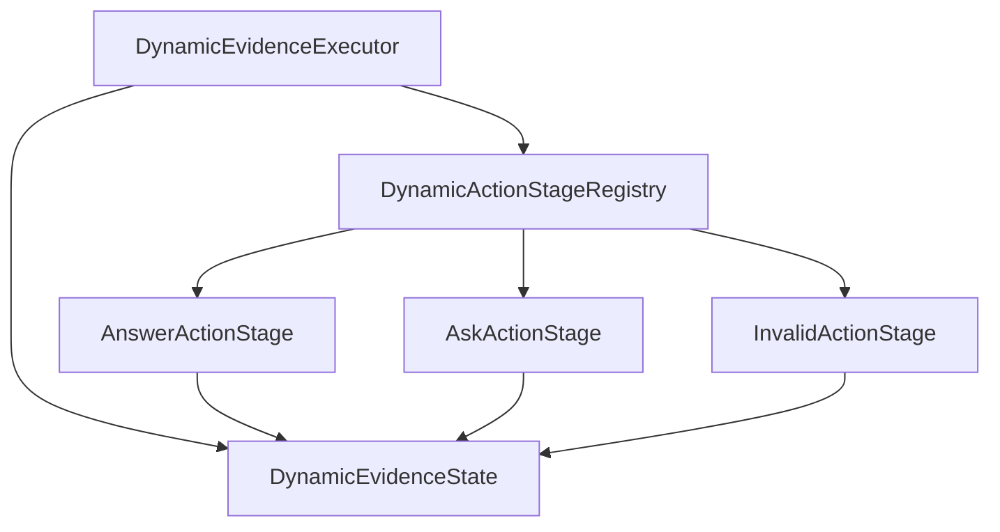

# refactor: decompose dynamic evidence actions

> Synthetic GitHub artifact: true  
> 최초 PR 시점의 설명입니다. 이후 리뷰 대화와 결과는 포함하지 않습니다.

## 요약

`DynamicEvidenceExecutor`의 action loop를 action별 stage와 실행 state로 분리했습니다.
planner protocol, memory recovery 정책, 결과 JSON은 유지합니다.

## 주요 변경사항

- `DynamicActionStageRegistry`가 `answer`, `ask`, 지원하지 않는 action을 각각의
  실행 Strategy로 연결합니다.
- `DynamicEvidenceState`가 step 결과, action log, memory dependency, memory 사용
  여부를 한 곳에서 관리합니다.
- state가 dependency를 id 기준으로 중복 제거하고, step 기록과 answer lookup을 함께
  갱신합니다.
- invalid action도 action log에 기록된 뒤 `dynamic_failed` 결과로 끝납니다.
- 기존 dynamic decomposition 시나리오와 새 stage/state 단위 테스트를 함께 검증했습니다.

## 설계 — Action Strategy와 State Object

기존에는 한 loop가 action 종류 판별과 상태 변경, 결과 생성을 모두 수행했습니다.
이제 action name은 `DynamicActionStageRegistry`에서 Strategy 구현체로 선택되고,
`DynamicEvidenceState`가 실행 중 공유되는 mutable state를 소유합니다. executor는
context 생성·stage 실행 순서·최종 종료만 조정합니다.

### 변경 전



### 변경 후



## Review Points

1. **action 전환의 책임 경계** — stage registry가 `answer`·`ask`·지원하지 않는 action을
   나누고, executor는 context와 반복 순서만 담당합니다. invalid action도 기록 뒤 실패하는
   흐름이 planner 관찰성과 기존 종료 정책을 함께 보존하는지 확인 부탁드립니다.

2. **공유 state의 일관성** — state는 step·answer lookup·memory dependency를 함께
   갱신하며 dependency는 id 기준으로 한 번만 남깁니다. 기존 scripted dynamic 실행 JSON
   동등성 비교가 이 상태 이동을 충분히 보호하는지 봐 주세요.

## PR Type

- [ ] ✨ Feature
- [ ] 🐛 Bugfix
- [x] ♻️ Refactoring (no functional changes, no api changes)
- [ ] 🎨 Code style update
- [ ] 📚 Docs
- [ ] 🔧 Other

## 테스트

```bash
python3 -m unittest tests.test_decomposition_stages -q
python3 -m unittest tests.test_decomposition -q
python3 -m unittest discover -s tests -q
```

새 stage/state 테스트 3건, 기존 decomposition 테스트 22건, 전체 테스트 86건이
통과했습니다. 대표 scripted dynamic 실행의 전체 JSON은 변경 전과 `diff` 차이가 없습니다.

## Todos

- [ ] 리뷰 의견 반영
