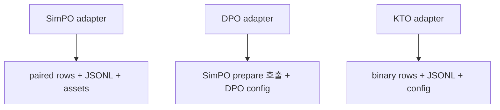
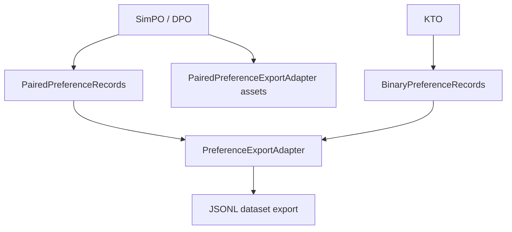

# refactor: separate preference export strategies

> Synthetic GitHub artifact: true  
> 최초 PR 시점의 설명입니다. 이후 리뷰 대화와 결과는 포함하지 않습니다.

## 요약

SimPO·DPO·KTO의 preference 학습 행 변환을 전략별로 분리하고, 공통 JSONL export를
`PreferenceExportAdapter`에 모았습니다. training script, config, artifact, command
결과는 유지합니다.

## 주요 변경사항

- `PairedPreferenceRecords`는 완전한 chosen/rejected pair만 학습 행으로 만들고 skip
  수를 기록합니다.
- `BinaryPreferenceRecords`는 chosen·rejected를 각각 독립된 label 행으로 만듭니다.
- `PreferenceExportAdapter`가 strategy 실행과 JSONL 기록을 공통으로 처리합니다.
- `PairedPreferenceExportAdapter`가 SimPO/DPO의 paired dataset, training script,
  `simpo_config.json` 생성을 공유합니다.
- DPO의 추가 `dpo_config.json`, 빈 command, KTO의 binary artifact 계약은 유지합니다.

## 설계 — Record Strategy와 Export Template Method

학습 목적마다 “어떤 request가 몇 개의 학습 행이 되는가”는 다르지만, dataset을 만들고
JSONL을 쓰는 절차는 같습니다. record Strategy가 행의 의미를 결정하고, base adapter가
공통 export를 수행합니다. paired export는 SimPO/DPO가 함께 쓰는 asset 생성 순서를
Template Method로 제공합니다.

### 변경 전



### 변경 후



## Review Points

1. **paired·binary 행 계약** — paired 전략은 불완전한 pair를 skip하고, binary 전략은
   available chosen/rejected를 독립 행으로 남깁니다. 각 training objective가 기대하는
   데이터 의미와 skip count의 책임이 strategy에 적절히 놓였는지 확인 부탁드립니다.

2. **공유 asset과 기존 artifact 보존** — SimPO/DPO는 paired dataset과 SimPO asset을
   공유하지만 DPO는 기존처럼 별도 config와 빈 command를 반환합니다. SimPO·DPO·KTO의
   정규화된 manifest·JSON/JSONL 동등성 비교가 이 계약을 충분히 보호하는지 봐 주세요.

## PR Type

- [ ] ✨ Feature
- [ ] 🐛 Bugfix
- [x] ♻️ Refactoring (no functional changes, no api changes)
- [ ] 🎨 Code style update
- [ ] 📚 Docs
- [ ] 🔧 Other

## 테스트

```bash
python3 -m unittest tests.test_pipeline_preference_export -q
python3 -m unittest tests.test_pipeline -q
python3 -m unittest discover -s tests -q
```

새 preference export 테스트 4건, 기존 pipeline 테스트 5건, 전체 테스트 90건이
통과했습니다. 세 adapter의 정규화된 manifest와 JSON/JSONL artifact는 변경 전과 같습니다.

## Formatting

각 코드 커밋 직전에 Black 26.5.1을 적용했습니다. 변경된 Python 파일의 comment token과 module/class/function docstring은 제거했으며, SQL·script template·test fixture 같은 실행용 multiline string 값은 보존했습니다. 최초 PR snapshot을 포함한 최종 변경 파일은 `black --check`를 통과했고, 원본과 재작성본의 실행 AST도 동일합니다.

## Todos

- [ ] 리뷰 의견 반영
