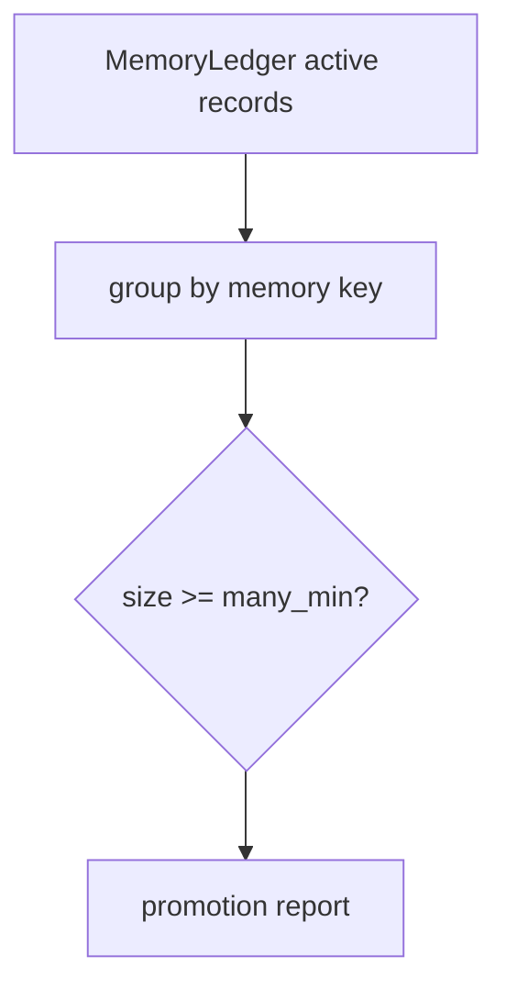
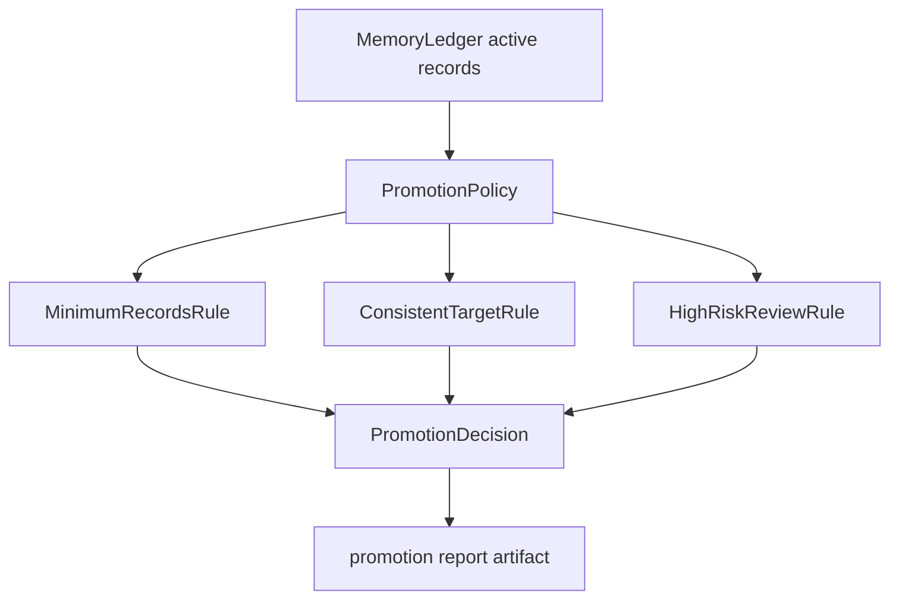

# refactor: separate memory promotion policy

> Synthetic GitHub artifact: true  
> 최초 PR 시점의 설명입니다. 이후 리뷰 대화와 결과는 포함하지 않습니다.

## 요약

Memory Ledger의 training promotion 판정을 `PromotionPolicy`와 독립 Rule로 분리했습니다.
active record 수만 보던 report가 target 충돌과 high-risk 검토 요구도 함께 설명하고, ledger는
record 수집과 artifact export 책임에 집중합니다.

## 주요 변경사항

- `PromotionDecision` Value Object가 cluster의 target, record ID, 차단 사유, manual review 여부를
  직렬화합니다.
- `MinimumRecordsRule`, `ConsistentTargetRule`, `HighRiskReviewRule`이 promotion eligibility를
  독립적으로 판단합니다.
- `PromotionPolicy`가 Rule 결과를 조합하고 cluster를 deterministic하게 정렬합니다.
- `MemoryLedger.promotion_report(many_min)`는 기존 호출 형식을 유지하면서 default Policy에
  위임합니다.
- 명시적 Policy에서는 reviewed workflow를 위해 high-risk gate를 해제할 수 있습니다.

## 설계 — Policy·Strategy와 Decision Value Object

promotion은 persistence 규칙이 아니라 “이 cluster를 training으로 올려도 되는가”라는 선택
정책입니다. Rule Strategy가 각 차단 조건을 평가하고, Policy가 이를 조합합니다. ledger는
Policy의 decision을 export할 뿐 판단 분기를 갖지 않습니다.

### 변경 전



### 변경 후



## Review Points

1. **Policy boundary** — ledger가 active record를 모으고 export만 하며, training eligibility는
   Policy/Rule이 갖도록 분리했습니다. persistence와 promotion workflow의 책임 경계가 적절한지
   확인 부탁드립니다.

2. **안전한 기본값과 override** — target 충돌과 high-risk는 기본 Policy에서 automatic promotion을
   막습니다. reviewed workflow는 `require_risk_review=False`를 명시해야만 high-risk를 허용합니다.
   default safety와 explicit override의 균형이 적절한지 검토 부탁드립니다.

## PR Type

- [ ] ✨ Feature
- [ ] 🐛 Bugfix
- [x] ♻️ Refactoring (behavioral policy clarified)
- [ ] 🎨 Code style update
- [ ] 📚 Docs
- [ ] 🔧 Other

## 테스트

```bash
python3 -m unittest tests.test_memory_ledger -q
python3 -m unittest tests.test_update_db -q
python3 -m unittest discover -s tests -q
```

새 promotion policy 테스트 5건, ledger 테스트 2건, Update DB 테스트 4건, 전체 테스트 106건이
통과했습니다.

## Todos

- [ ] 리뷰 의견 반영
