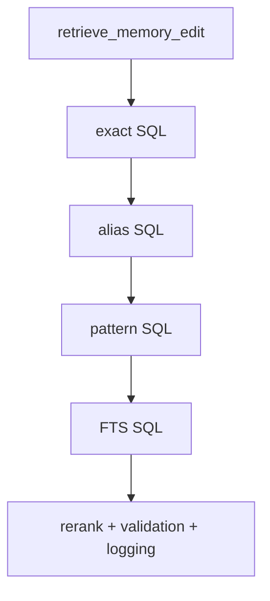
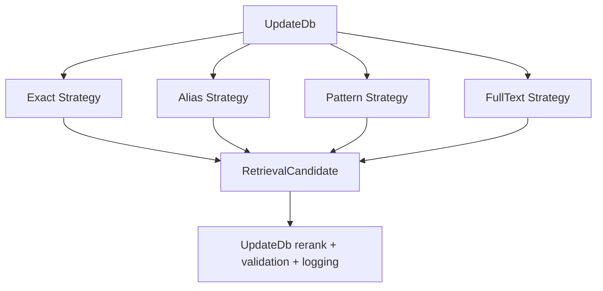

# refactor: extract memory retrieval strategies

> Synthetic GitHub artifact: true  
> 최초 PR 시점의 설명입니다. 이후 리뷰 대화와 결과는 포함하지 않습니다.

## 요약

`UpdateDb.retrieve_memory_edit()`의 exact, alias, pattern, FTS 후보 조회를 route별
`RetrievalStrategy`로 분리했습니다. 최종 candidate 선택, semantic rerank, answer-type gate,
threshold, audit logging은 `UpdateDb`의 공통 정책으로 유지합니다.

## 주요 변경사항

- `RetrievalCandidate` Value Object가 route, DB row, 초기 score를 전달합니다.
- `ExactRetrievalStrategy`, `AliasRetrievalStrategy`, `PatternRetrievalStrategy`,
  `FullTextRetrievalStrategy`가 각 SQL prefilter를 담당합니다.
- `default_retrieval_strategies()`가 established retrieval order를 한 곳에서 관리합니다.
- `UpdateDb` constructor는 explicit Strategy sequence를 받아 empty lookup 또는 테스트용
  custom route를 지원합니다.
- rerank와 answer-type 검증은 모든 route에 같은 기준을 적용하도록 `UpdateDb`에 남겼습니다.

## 설계 — Retrieval Strategy와 Candidate Value Object

route마다 “어떤 row를 후보로 볼지”와 초기 lexical score는 다르지만, candidate를 선택할지와
로그로 남길지는 공통 정책입니다. Strategy는 후보 조회만 담당하고, `UpdateDb`는 결과 정책을
한 번 적용합니다.

### 변경 전



### 변경 후



## Review Points

1. **책임 경계** — Strategy는 prefilter와 initial score만 반환하고, semantic rerank와
   answer-type/threshold 선택은 `UpdateDb`가 유지합니다. 모든 route에 같은 final policy를
   적용하는 경계가 적절한지 확인 부탁드립니다.

2. **순서와 injection 계약** — default order는 exact → alias → pattern → FTS이고 첫 non-empty
   route에서 멈춥니다. 빈 목록은 explicit disable이며 custom Strategy는 raw/normalized query를
   받습니다. 이 설정 API가 기존 lookup 의미를 충분히 보존하는지 검토 부탁드립니다.

## PR Type

- [ ] ✨ Feature
- [ ] 🐛 Bugfix
- [x] ♻️ Refactoring (no functional changes, no api changes)
- [ ] 🎨 Code style update
- [ ] 📚 Docs
- [ ] 🔧 Other

## 테스트

```bash
python3 -m unittest tests.test_update_db -q
python3 -m unittest tests.test_memory_ledger -q
python3 -m unittest discover -s tests -q
```

새 retrieval Strategy 테스트 4건, 기존 Update DB 테스트 4건, Memory Ledger 테스트 7건,
전체 테스트 110건이 통과했습니다.

## Todos

- [ ] 리뷰 의견 반영
