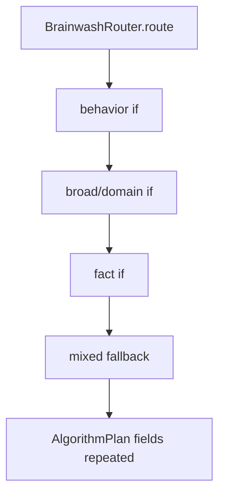
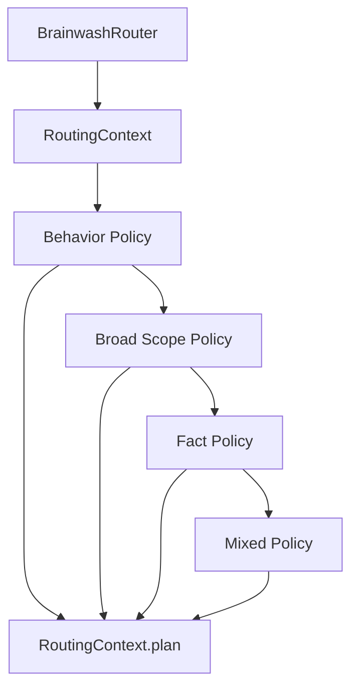

# refactor: decompose routing policies

> Synthetic GitHub artifact: true  
> 최초 PR 시점의 설명입니다. 이후 리뷰 대화와 결과는 포함하지 않습니다.

## 요약

batch routing을 behavior, broad/domain, fact, mixed lane의 `RoutingPolicy`로 분리했습니다.
`RoutingContext`가 stats·thresholds·warnings·공통 `AlgorithmPlan` 생성을 맡아 기존 plan contract를
유지하고, `BrainwashRouter`는 Policy precedence만 조율합니다.

## 주요 변경사항

- `RoutingContext`가 immutable `BatchStats`, threshold payload, warnings를 만들고 common plan field를
  일관되게 채웁니다.
- `BehaviorRoutingPolicy`, `BroadScopeRoutingPolicy`, `FactRoutingPolicy`가 자신이 소유하지 않는
  batch에 대해 `None`을 반환해 다음 lane으로 넘깁니다.
- `MixedRoutingPolicy`가 terminal fallback으로 mixed batch를 처리합니다.
- `default_routing_policies()`가 established precedence를 한 곳에서 관리합니다.
- `BrainwashRouter`는 custom Policy sequence를 받아 확장하되 empty batch validation은 유지합니다.

## 설계 — Chain of Responsibility와 Plan Factory

각 routing lane은 batch를 처리하거나 다음 lane에 넘기는 Chain of Responsibility입니다.
`RoutingContext.plan()`은 모든 lane이 공유하는 `AlgorithmPlan` field를 생성하는 Factory 역할을
수행해 warnings·stats payload·verifier contract가 분기마다 달라지지 않게 합니다.

### 변경 전



### 변경 후



## Review Points

1. **precedence와 terminal fallback** — focused Policy는 `None`으로 다음 lane에 위임하고 mixed
   Policy만 항상 plan을 반환합니다. 기존 behavior → broad/domain → fact → mixed 순서와
   conflict memory mode가 보존되는지 확인 부탁드립니다.

2. **공통 plan field의 단일 출처** — `RoutingContext`가 warnings, thresholds, stats, verifier를
   공통 생성합니다. lane별 algorithm 선택은 분리하면서 `AlgorithmPlan` serialization contract를
   한 곳에서 유지한 책임 경계가 적절한지 검토 부탁드립니다.

## PR Type

- [ ] ✨ Feature
- [ ] 🐛 Bugfix
- [x] ♻️ Refactoring (no functional changes, no api changes)
- [ ] 🎨 Code style update
- [ ] 📚 Docs
- [ ] 🔧 Other

## 테스트

```bash
python3 -m unittest tests.test_router -q
python3 -m unittest tests.test_update_db -q
python3 -m unittest discover -s tests -q
```

새 routing Policy 테스트 3건, 기존 Router 테스트 6건, Update DB 테스트 8건, 전체 테스트
113건이 통과했습니다.

## Formatting

각 코드 커밋 직전에 Black 26.5.1을 적용했습니다. 최초 PR snapshot을 포함한 최종 변경 파일은 `black --check`를 통과했으며, 재작성 전후 변경 Python 파일의 AST도 동일하게 확인했습니다.

## Todos

- [ ] 리뷰 의견 반영
