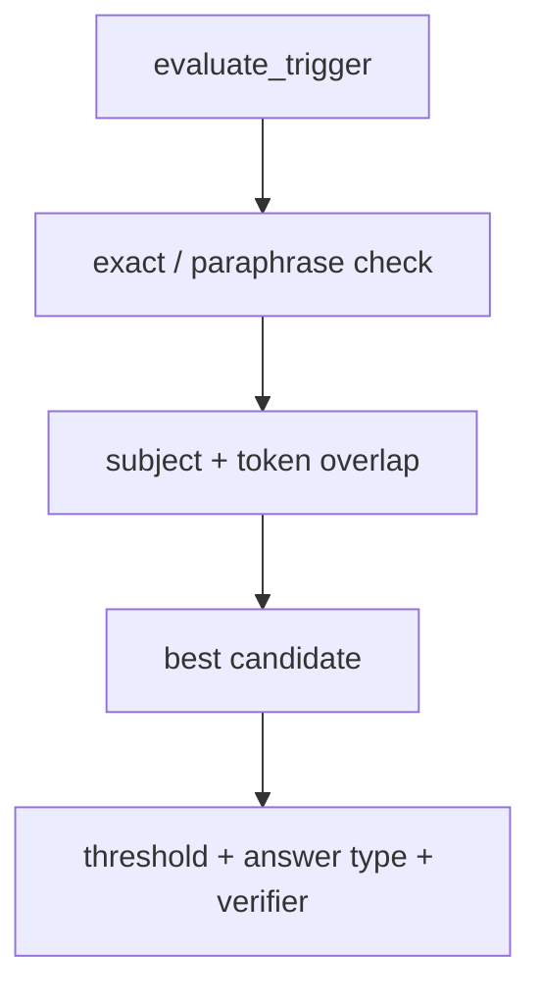
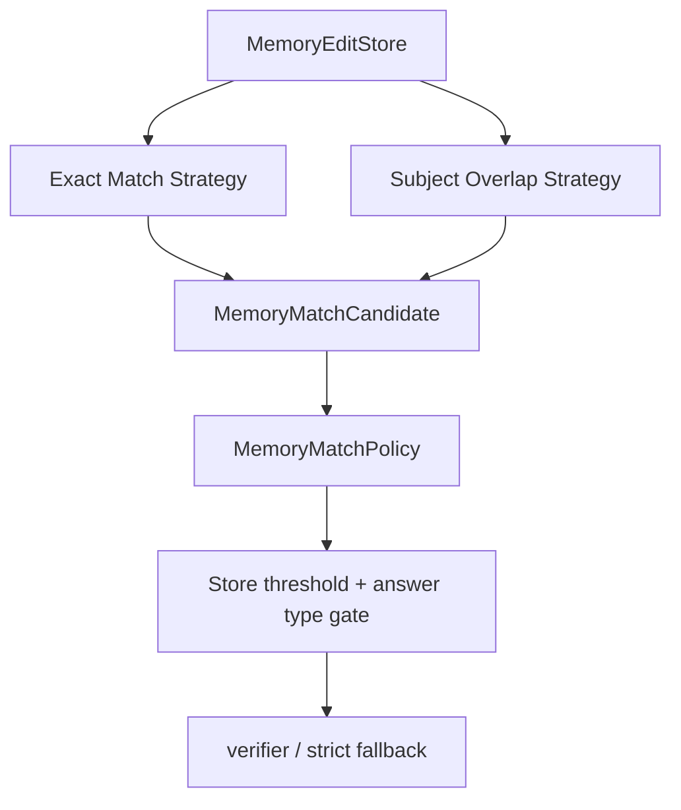

# refactor: separate memory match strategies

> Synthetic GitHub artifact: true  
> 최초 PR 시점의 설명입니다. 이후 리뷰 대화와 결과는 포함하지 않습니다.

## 요약

`MemoryEditStore`의 exact/paraphrase와 subject-aware token overlap 후보 탐색을
`MemoryMatchStrategy`로 분리했습니다. `MemoryMatchPolicy`가 best candidate를 선택하고,
threshold·answer-type gate·verifier·strict fallback은 기존처럼 store가 공통 처리합니다.

## 주요 변경사항

- `MemoryMatchCandidate` Value Object가 edit, candidate prompt, score, match evidence를 표현합니다.
- `ExactMemoryMatchStrategy`가 canonical prompt와 paraphrase의 exact match를 처리합니다.
- `SubjectTokenOverlapStrategy`가 subject token guard가 통과한 edit만 lexical overlap으로 평가합니다.
- `MemoryMatchPolicy`가 edit order를 보존하면서 highest score candidate를 선택합니다.
- `MemoryEditStore`는 default Strategy 또는 explicit custom/empty Strategy sequence를 받습니다.

## 설계 — Match Strategy와 Selection Policy

“어떤 edit가 query와 닮았는가”와 “그 candidate를 memory trigger로 수락할 것인가”는 다른
책임입니다. Strategy는 match evidence만 만들고, Selection Policy는 candidate를 하나 고릅니다.
`MemoryEditStore`는 common threshold와 answer-type safety policy를 적용합니다.

### 변경 전



### 변경 후



## Review Points

1. **candidate evidence와 safety gate 경계** — Strategy는 score·candidate prompt·match 근거만
   반환하고, threshold와 answer-type validation은 store에 남겼습니다. exact/overlap route에
   같은 final safety policy를 적용하는 책임 경계가 적절한지 확인 부탁드립니다.

2. **order와 explicit disable** — default는 exact/paraphrase → subject-aware overlap이며, 빈
   Strategy tuple은 memory triggering을 명시적으로 끕니다. custom matcher injection이 기존
   strict fallback과 trigger reason 계약을 해치지 않는지 검토 부탁드립니다.

## PR Type

- [ ] ✨ Feature
- [ ] 🐛 Bugfix
- [x] ♻️ Refactoring (no functional changes, no api changes)
- [ ] 🎨 Code style update
- [ ] 📚 Docs
- [ ] 🔧 Other

## 테스트

```bash
python3 -m unittest tests.test_memory_edit_runtime -q
python3 -m unittest tests.test_update_db -q
python3 -m unittest discover -s tests -q
```

새 match Strategy 테스트 4건, 기존 memory runtime 테스트 9건, Update DB 테스트 8건,
전체 테스트 117건이 통과했습니다.

## Formatting

각 코드 커밋 직전에 Black 26.5.1을 적용했습니다. 변경된 Python 파일의 comment token과 module/class/function docstring은 제거했으며, SQL·script template·test fixture 같은 실행용 multiline string 값은 보존했습니다. 최초 PR snapshot을 포함한 최종 변경 파일은 `black --check`를 통과했고, 원본과 재작성본의 실행 AST도 동일합니다.

## Todos

- [ ] 리뷰 의견 반영
