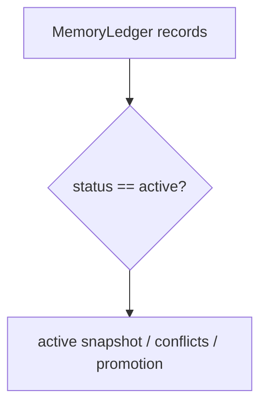
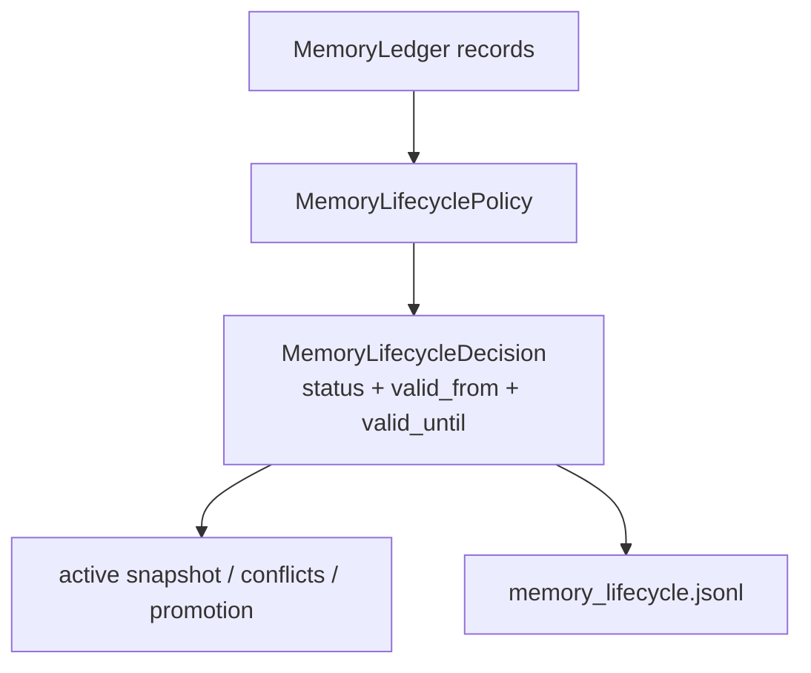

# refactor: centralize memory lifecycle policy

> Synthetic GitHub artifact: true  
> 최초 PR 시점의 설명입니다. 이후 리뷰 대화와 결과는 포함하지 않습니다.

## 요약

Memory Ledger의 active record 판정을 `MemoryLifecyclePolicy`로 통합했습니다. status만 보던
in-memory filtering이 `valid_from`/`valid_until`까지 DB `active_memory` view와 같은 lifecycle
계약을 적용하고, record별 decision을 audit artifact로 남깁니다.

## 주요 변경사항

- `MemoryLifecycleDecision` Value Object가 record ID, active 여부, reason, evaluation time을
  직렬화합니다.
- `MemoryLifecyclePolicy`가 retired status, future start, expired end, invalid timestamp를
  명시적으로 판정합니다.
- `MemoryLedger.active_records()`가 optional `as_of`로 deterministic temporal filtering을 지원합니다.
- active snapshot, conflicts, exact index, promotion report가 lifecycle-filtered record를 사용합니다.
- `write_artifacts()`가 `memory_lifecycle.jsonl` audit artifact를 추가합니다.

## 설계 — Lifecycle Policy와 Decision Value Object

record persistence와 “지금 이 record가 active인가”는 다른 책임입니다. Ledger는 record·snapshot·artifact를
관리하고, Lifecycle Policy는 status와 time window를 판단합니다. Decision Value Object가 결과를 남겨
운영자가 future/expired record가 왜 제외됐는지 확인할 수 있습니다.

### 변경 전



### 변경 후



## Review Points

1. **DB/in-memory active contract** — Policy는 DB view와 같이 active status, start-inclusive,
   end-exclusive window를 적용합니다. future/expired/invalid record를 inactive로 두는 안전한
   기본값과 reason format이 적절한지 확인 부탁드립니다.

2. **time injection과 artifact boundary** — `as_of`는 deterministic test와 audit에만 주입하고,
   default runtime은 UTC now를 사용합니다. ledger가 lifecycle decision을 재사용하고 file write만
   맡는 책임 경계가 적절한지 검토 부탁드립니다.

## PR Type

- [ ] ✨ Feature
- [ ] 🐛 Bugfix
- [x] ♻️ Refactoring (lifecycle contract clarified)
- [ ] 🎨 Code style update
- [ ] 📚 Docs
- [ ] 🔧 Other

## 테스트

```bash
python3 -m unittest tests.test_memory_ledger -q
python3 -m unittest tests.test_update_db -q
python3 -m unittest discover -s tests -q
```

새 lifecycle 테스트 3건, 기존 ledger 테스트 7건, Update DB 테스트 8건, 전체 테스트 120건이
통과했습니다.

## Formatting

각 코드 커밋 직전에 Black 26.5.1을 적용했습니다. 변경된 Python 파일의 comment token과 module/class/function docstring은 제거했으며, SQL·script template·test fixture 같은 실행용 multiline string 값은 보존했습니다. 최초 PR snapshot을 포함한 최종 변경 파일은 `black --check`를 통과했고, 원본과 재작성본의 실행 AST도 동일합니다.

## Todos

- [ ] 리뷰 의견 반영
