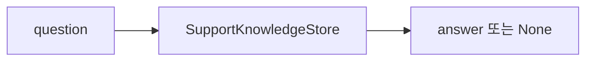

# feat: trace support retrieval results

> Synthetic GitHub artifact: true  
> 최초 PR 시점의 설명입니다. 이후 리뷰 대화와 반영 commit은 포함하지 않습니다.

## 요약

support knowledge 조회 결과를 answer만이 아니라 query, normalized query, source, score, reason까지
담은 `SupportRetrieval`로 기록합니다. 기존 `retrieve()`는 새 trace API에 위임하되 answer 반환 계약은
유지합니다.

## 주요 변경사항

- `SupportRetrieval` Value Object가 조회 근거와 결과를 직렬화 가능한 형태로 표현합니다.
- exact, semantic, lexical, no-match 경로가 각각 source와 reason을 남깁니다.
- `SupportKnowledgeStore.retrieve_with_trace()`와 batch용 `retrieve_many_with_trace()`를 추가했습니다.
- 기존 `retrieve()`는 trace의 answer를 반환해 기존 caller와 호환됩니다.

## 설계 의도

조회 과정의 의사결정을 실행부와 분리해 관찰 가능한 결과 객체로 만들었습니다. 이는 Value Object 패턴을
적용한 것으로, trace가 불변의 조회 사실을 표현하고 store는 조회 전략 선택만 담당합니다. batch도 입력
순서대로 trace를 반환해 evaluation·debugging 단계가 별도 side channel 없이 결과를 분석할 수 있게 합니다.



```mermaid
flowchart LR
  Q[question] --> S[SupportKnowledgeStore]
  S --> T[SupportRetrieval\nanswer · source · score · reason]
  T --> A[retrieve(): answer]
  T --> B[batch / evaluation trace]
```

## Review Points

1. **score 의미** — semantic 경로의 수락 threshold와 trace에 남기는 confidence score의 책임을
   구분한 위치가 적절한지 검토 부탁드립니다.

2. **API compatibility** — 기존 `retrieve()`를 유지하면서 trace API를 추가한 것이 caller migration과
   관찰 가능성 사이의 경계로 적절한지 확인 부탁드립니다.

## PR Type

- [x] ✨ Feature
- [ ] 🐛 Bugfix
- [ ] ♻️ Refactoring (no functional changes, no api changes)
- [ ] 🎨 Code style update
- [ ] 📚 Docs
- [ ] 🔧 Other

## 테스트

```bash
python3 -m unittest discover -s tests -q
```

기존 전체 test 99건이 통과했습니다. 최초 PR에는 semantic observed score와 batch trace를 직접
검증하는 test는 포함하지 않았습니다.

## Todos

- [ ] 리뷰 의견 반영
