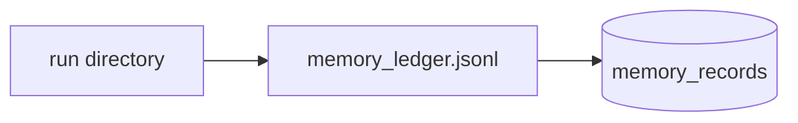
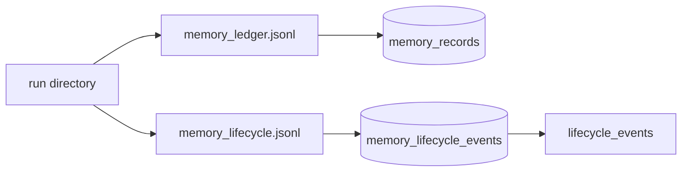

# feat: import memory lifecycle audits

> Synthetic GitHub artifact: true  
> 최초 PR 시점의 설명입니다. 이후 리뷰 대화와 반영 commit은 포함하지 않습니다.

## 요약

run artifact에 기록된 `memory_lifecycle.jsonl`을 Update DB로 import하고, memory별 lifecycle event를 조회할 수 있게 합니다.

## 주요 변경사항

- `memory_lifecycle_events` table과 memory/timestamp lookup index를 추가했습니다.
- `ingest_run_artifacts()`가 ledger import 뒤 lifecycle artifact를 적재합니다.
- `ingest_memory_lifecycle_rows()`가 audit row를 저장합니다.
- `lifecycle_events(memory_id)`로 최신 event부터 조회할 수 있습니다.

## 설계 의도

lifecycle audit는 memory record의 현재 상태를 덮어쓰는 데이터가 아니라, 상태 평가의 이력을 보존하는 데이터입니다.
따라서 별도 event table을 두고 `(memory_id, evaluated_at, source)`를 unique key로 사용했습니다. 이 구조는
Event Log 패턴을 적용한 것으로, 현재 memory record와 audit history의 책임을 분리합니다.





## Review Points

1. **artifact type contract** — 외부 JSON의 `active` 값을 DB의 0/1 상태로 바꾸는 경계가 충분히 명확한지 검토 부탁드립니다.
2. **import observability** — lifecycle import 결과를 기존 report API에 어느 수준까지 노출하는 것이 적절한지 확인 부탁드립니다.

## PR Type

- [x] ✨ Feature
- [ ] 🐛 Bugfix
- [ ] ♻️ Refactoring (no functional changes, no api changes)
- [ ] 🎨 Code style update
- [ ] 📚 Docs
- [ ] 🔧 Other

## 테스트

```bash
python3 -m unittest discover -s tests -q
```

기존 전체 test 120건이 통과했습니다. 최초 PR에는 lifecycle artifact의 값 변환과 report 결과를 직접 검증하는 test는 포함하지 않았습니다.

## Formatting

각 코드 커밋 직전에 Black 26.5.1을 적용했습니다. 최초 PR snapshot을 포함한 최종 변경 파일은 `black --check`를 통과했으며, 재작성 전후 변경 Python 파일의 AST도 동일하게 확인했습니다.

## Todos

- [ ] 리뷰 의견 반영
